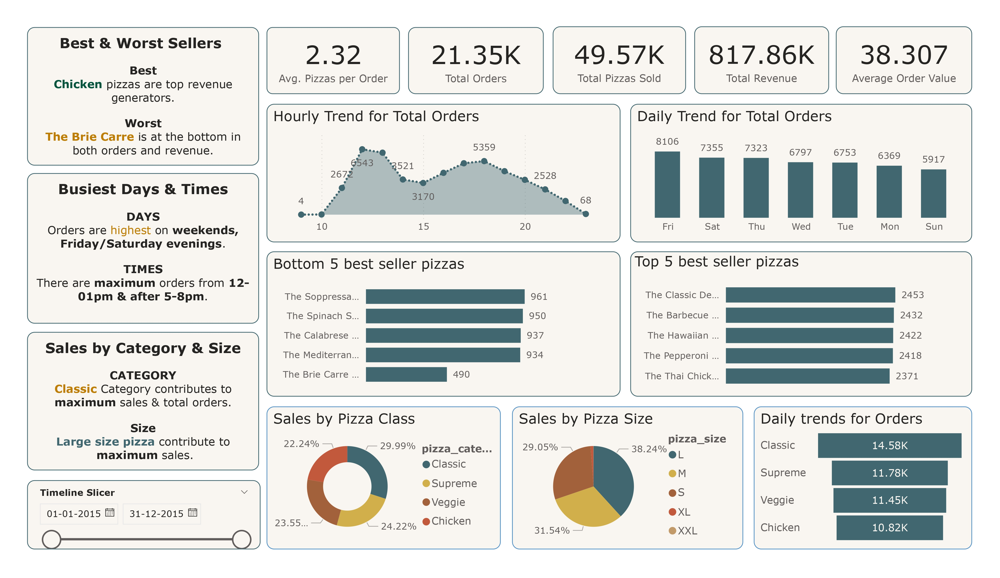

# :pizza: Pizza Sales Analysis

## :chart_with_upwards_trend: Dashboard

## :seedling: Overview
This project involves extracting, analyzing, and visualizing pizza sales data from a PostgreSQL database to gain insights into sales trends and patterns.

## :placard: Workflow
1. **Database Connection**:
   - Connected to the PostgreSQL database using SQL magic commands in Jupyter Notebook.

2. **Data Extraction**:
   - Executed SQL queries within Jupyter Notebook to extract relevant data.

3. **Data Analysis**:
   - Cleaned the data using Power BI.
   - Performed data cleaning and transformation using pandas.
   - Conducted exploratory data analysis (EDA) to identify key trends and insights.

4. **Data Visualization**:
   - Created visualizations using Matplotlib and Seaborn, including bar plots, histograms, and line charts.
   - Created a dashboard in Power BI to present the findings.

## Tools and Technologies
- **Languages**: Python, SQL
- **Frameworks**: TensorFlow, Scikit-Learn
- **Tools**: Jupyter Notebook, VS Code, PostgreSQL, Power BI, Git, Matplotlib, Seaborn

## :man_shrugging: Results
The analysis provided valuable insights into pizza sales trends, aiding in data-driven decision-making. Visualizations highlighted order distributions, top-selling pizzas, and sales patterns across different days and categories.

## :trollface: Author
### Satya Prakash Mohanty

  <a href="https://www.linkedin.com/in/satya04/[removed]" rel="nofollow noreferrer">
     LinkedIn
  </a> &nbsp; 

